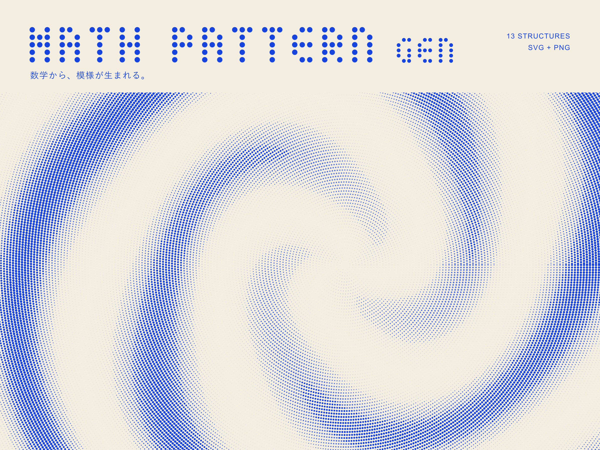
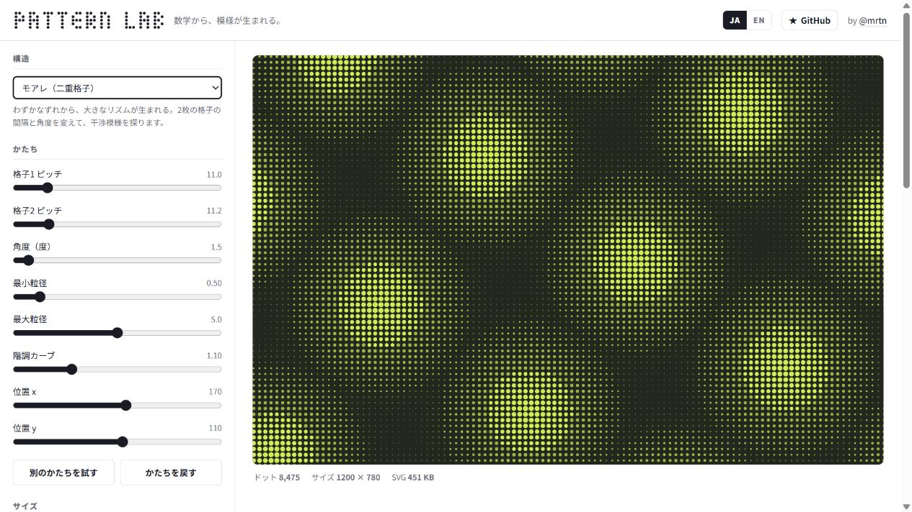
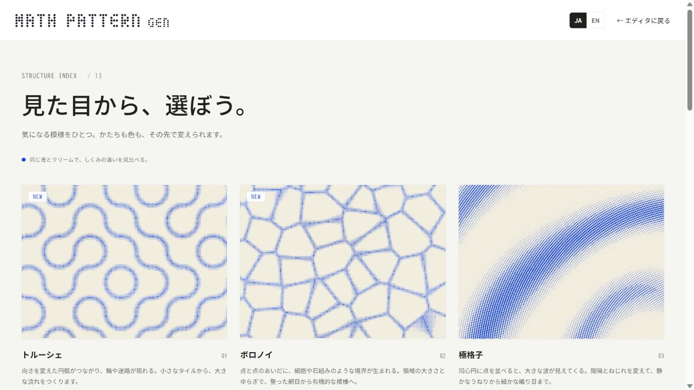
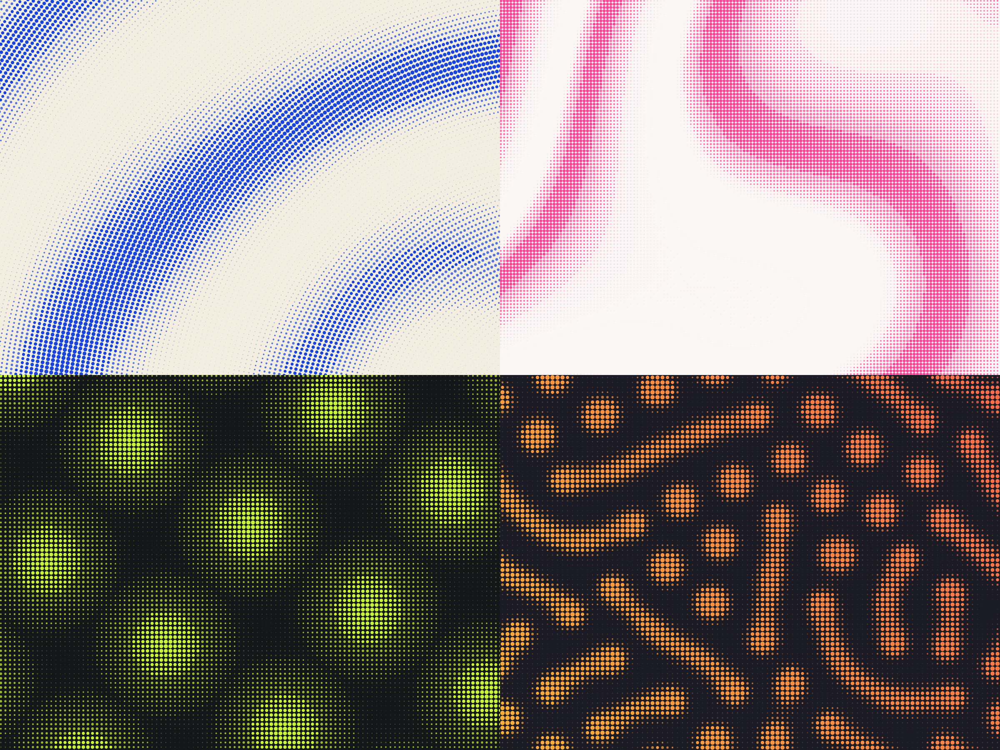
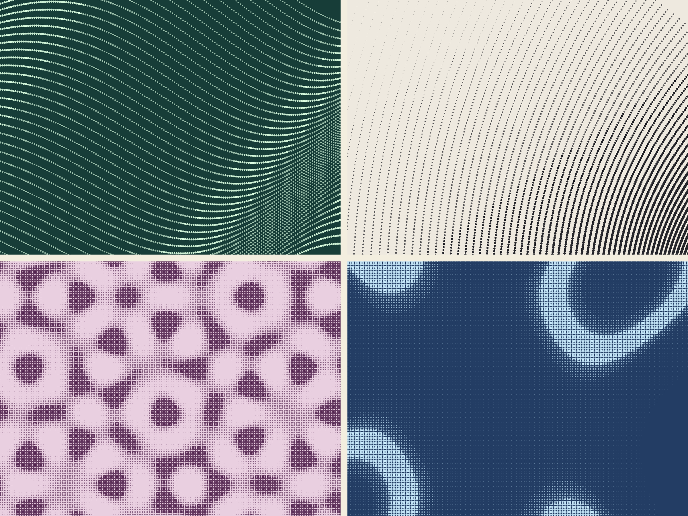

# Math Pattern Gen

[日本語](README.md) | **English**

[](https://martin-ushiyama.github.io/math-pattern-gen/)

## Patterns, born from math.

Change the spacing. Layer the waves. Choose the colors.

Math Pattern Gen is a small browser tool for creating background patterns from mathematical structures. Explore 13 structures, tune their geometry, and export the result as SVG or PNG for covers, social graphics, slides, and more.

**[Create a pattern in your browser →](https://martin-ushiyama.github.io/math-pattern-gen/)**

No installation or account required. It opens with the cobalt-and-cream pattern shown above.

## Choose, shape, and export

1. **Choose a structure.** Browse the thumbnails in the [structure gallery](https://martin-ushiyama.github.io/math-pattern-gen/structures.html), then open any pattern directly in the editor.
2. **Shape the geometry.** Move the sliders to adjust spacing, twist, density, and other parameters. “Try another shape” gives you a new combination to explore.
3. **Choose the colors.** Compare palettes in the Color tab, or build your own solid or gradient combination.
4. **Export the result.** Set the size in the Export tab and save it as PNG or SVG. Transparent backgrounds are available for both formats.

The interface separates shape, color, and export so you can refine the pattern while watching it change.



## Start with the look, not the equation

The collection includes connected Truchet arcs, cellular Voronoi fields, reaction–diffusion patterns, moiré, warped contours, and more. Every structure appears in the same cobalt-and-cream palette in the gallery, making their shapes easy to compare.

[](https://martin-ushiyama.github.io/math-pattern-gen/structures.html)

Selecting a card opens the editor with that card’s exact shape, palette, and canvas size. Use “Back to editor” at the top of the gallery to return to the pattern you were editing.

## One tool, many moods

The same set of dots can feel completely different when the structure and palette change. Every background below was created with Math Pattern Gen.

### Bold color



From top left: **Polar lattice / Warped contours / Moiré / Reaction–diffusion**.

### Quiet movement



From top left: **Draped cloth / Conformal map / Quasicrystal / Caustics**.

## Return to any pattern

**The same settings produce the same pattern.** Each result is determined by its structure, parameters, dimensions, and colors. “Try another shape” changes the parameter combination, but a given set of values remains reproducible.

Shape and color settings are stored in the URL. Bookmark a pattern you like and return to it later. The editor’s recipe view also exposes the values behind the current shape.

A saved URL’s palette takes priority over the default palette. If you replace one recipe URL with another in the same tab, reload the page to apply every setting.

## Export for the layout you need

| Format | Best for |
| --- | --- |
| **PNG** | Social graphics, slides, and places that do not accept SVG. Export at ×1 to ×4, subject to the device’s canvas limits. |
| **SVG** | Large formats and further editing in design tools. Dots stay crisp at any scale, and the SVG can also be copied directly. |
| **Transparent background** | Layering the pattern over photography or another design. Available for both SVG and PNG. |

The editor includes presets for OGP/social images, note covers, banners, slides, square posts, and portrait graphics. You can also enter any width and height directly. The interface is available in Japanese and English.

## The 13 structures

You do not need to know the math to use them. If you are curious, each structure includes a short explanation inside the editor.

| Structure | How it works and what it looks like |
| --- | --- |
| **Polar lattice (guilloché)** | Places dots on concentric circles and uses `cos(kθ + ar)` for tone, ranging from broad waves to a fine weave. |
| **Twisted ribbon** | Projects a three-dimensional ruled ribbon onto a plane. Overlapping point rows create natural changes in density. |
| **Draped cloth** | Views a wavy surface at an angle. Point density and the direction of light create soft shading. |
| **Conformal map** | Warps a grid with `w = z²` or `w = z + 1/z`, preserving crossing angles while turning straight lines into curved nets. |
| **Warped contours** | Places bands of level curves on a field made from layered waves, producing a flow that resembles water or terrain. |
| **Twisted grid** | Rotates and stretches each row of points, bending an orderly grid into a gentle sweep. |
| **Moiré** | Overlays two grids with slightly different spacing and angles, turning tiny offsets into large interference patterns. |
| **Quasicrystal** | Adds plane waves from several directions. Five- and seven-fold combinations feel ordered without repeating. |
| **Gibbs phenomenon** | Approximates a square wave with a Fourier partial sum, drawing the remaining oscillation near each edge as rows of dots. |
| **Caustics** | Derives tone from the local area of a mapping, creating arcs reminiscent of focused light at the bottom of a pool. |
| **Reaction–diffusion** | Runs a two-component Gray–Scott model to produce organic spots and maze-like forms. |
| **Truchet** | Rotates circular arcs within square tiles so neighboring tiles connect into loops and paths. |
| **Voronoi** | Uses the difference between the distances to the two nearest sites to draw either cellular boundaries or filled cells. |

## Three tips for stronger backgrounds

**Leave space between the dots.** Alternating dense and open areas gives the pattern depth. If the dots merge too much, reduce their size or the number of divisions.

**Let the pattern continue beyond the frame.** When it crosses all four edges, the crop feels like part of something larger.

**Move the center off canvas.** Shifting a vortex or singularity outside the frame emphasizes its flow instead of its central shape.

## Small on the inside, too

The generator lives in a single [`index.html`](index.html). It has no build step or runtime dependencies and works by opening the file in a browser.

The structure gallery is a static page made from [`structures.html`](structures.html) and pre-generated images. It does not recalculate all 13 structures every time it opens; its thumbnails and links come from the same representative recipes.

Each structure’s `gen(p, W, H)` function returns an array of dots shaped like `{x, y, r}`. Shared rendering code groups their radii into three levels and combines them into SVG paths. Adding a structure requires a parameter definition, a generator function, and one new entry in `ORDER`. Even tens of thousands of dots render in at most three paths.

To update the gallery, add a representative recipe to [`assets/gallery/recipes.json`](assets/gallery/recipes.json), then run the following with Node.js 22 or later. `sharp` is used only to generate images during development and is not shipped with the site.

```sh
npm ci
npm run build:gallery
npm test
```

For gallery copy or layout changes, edit [`scripts/structures.template.html`](scripts/structures.template.html) and [`assets/gallery/gallery.css`](assets/gallery/gallery.css). Tests cover deterministic output, parameter bounds, maximum dot counts, saved recipes, and the correspondence between gallery images and recipes.

The logo is built from dots, too. Its letters use a 3×5 dot matrix, while the favicon shows blue dots flowing along a curve. Social images and icons live in [`assets/brand/`](assets/brand/).

## Made by

[@mrtn](https://x.com/mrtn)

If you find the tool useful, a [GitHub star](https://github.com/martin-ushiyama/math-pattern-gen) is always appreciated.

## License

[MIT](LICENSE)
